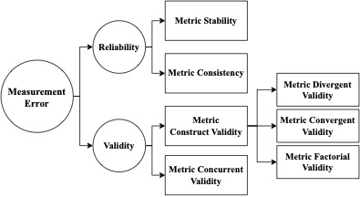

# MetricEval
MetricEval: A framework that conceptualizes and operationalizes four main components of metric evaluation, in terms of reliability and validity introduced in the paper [Evaluating Evaluation Metrics: A Framework for Analyzing NLG Evaluation Metrics using Measurement Theory](https://arxiv.org/abs/2305.14889). 



In this repo, you will find the supplementary material of our paper and the implementation of our framework, MetricEval, a python pkg for evaluation metrics analysis.

```
@article{xiao2023evaluating,
  title={Evaluating NLG Evaluation Metrics: A Measurement Theory Perspective},
  author={Xiao, Ziang and Zhang, Susu and Lai, Vivian and Liao, Q Vera},
  journal={arXiv preprint arXiv:2305.14889},
  year={2023}
}
```
## Supplementary Material
The summpelmentary material of our paper is organized as follows:
```
├── SupplementaryMaterials
│   ├── data
│   │   ├── MetricEval_SummEval.csv
│   │   ├── col_names.csv
│   ├── MetricEval_CaseStudy.Rmd
│   ├── cmle_lin_fa.R
```
MetricEval_CaseStudy.Rmd contains the code we used to conduct the case study in the paper. The data folder contains the data we used in the paper. The results presented in our paper along with additional analyses could be found in this file.

## Metric Eval
### Quickstart
Clone the repository:
```bash
git clone git@github.com:isle-dev/MetricEval.git
cd MetricEval
```

Install Dependencies:
```bash
conda create --name MetricEval python=3.10
conda activate MetricEval
pip install -r requirements.txt
```


## Contact
If you have any questions, please contact [Ziang Xiao](https://www.ziangxiao.com/) at ziang dot xiao at jhu dot edu.