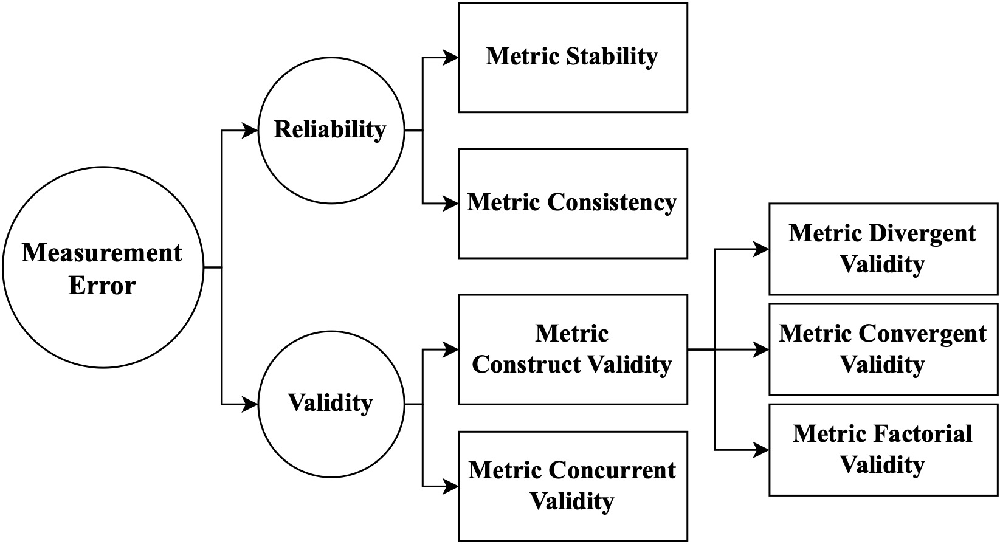

# MetricEval
MetricEval: A framework that conceptualizes and operationalizes four main components of metric evaluation, in terms of reliability and validity. Please see [Evaluating Evaluation Metrics: A Framework for Analyzing NLG Evaluation Metrics using Measurement Theory](https://arxiv.org/abs/2305.14889) for more details. 



## Summary

In this repo, you will find the implementation of our framework, metric-eval, a python pkg for evaluation metrics analysis.

```
@article{xiao2023evaluating,
  title={Evaluating Evaluation Metrics: A Framework for Analyzing NLG Evaluation Metrics using Measurement Theory},
  author={Xiao, Ziang and Zhang, Susu and Lai, Vivian and Liao, Q Vera},
  journal={arXiv preprint arXiv:2305.14889},
  year={2023}
}
```
## metirc-eval

### Quick Start

#### Install from PyPI
```bash
pip install metric-eval
```

### Usage
Please refer to metric_eval/example.py for the detailed usage of metirc-eval. The interpretation of the results could be found in our [paper](https://arxiv.org/abs/2305.14889).

#### Import Module
```python
import metric_eval
```

#### Load Data
Example data could be found in metric_eval/data/*. The data is a csv file with the following format:
```python
- test_id: array containing ids of test examples
- model_id: character array containing ids of models
- additional columns containing scores on each metric (metric name as column name)
```

```python
data = pd.read_csv("data/metric_scores_long.csv")
data_2nd_run = pd.read_csv("data/metric_scores_long_2nd_run.csv")
```

#### Metric Stability
The function compares the average metric scores for models between the two data sets (data1 and data2). It calculates the Pearson correlation coefficient between the average metric scores from the first run (data) and the second run (data_2nd_run) for each metric.


```python
rel_cor = metric_eval.metric_stability(data,data_2nd_run)
print(rel_cor)
```

#### Metric Consistency
Metric Consistency describes how the metric score fluctuates within a benchmark dataset, i.e., across data points. Metric consistency estimates (alphas) and the standard error of measurement (sems) of each metric given N randomly samples. Defult N (-1) refers all avaliable samples in the dataset.

```python
alphas, sems = metric_eval.metric_consistency(data, N = -1)
print(alphas)
print(sems)
```

#### MTMM Table
The MTMM table presents a way to scrutinize whether observed metric scores act in concert with theory on what they intend to measure, when two or more constructs are measured using two or more methods. By convention, an MTMM table reports the pairwise correlations of the observed metric scores across raters and traits on the off-diagonals and the reliability coefficients of each score on the diagonals.

```python
metric_names = data.columns[2:14].tolist()
trait = ['COH', 'CON', 'FLU', 'REL'] * 3
method = ['Expert_1'] * 4 + ['Expert_2'] * 4 + ['Expert_3'] * 4

# Create the MTMM_design DataFrame
MTMM_design = pd.DataFrame({
    'trait': trait,
    'method': method,
    'metric': metric_names
})

MTMM_result = metric_eval.MTMM(data, MTMM_design, method = 'pearson')
print(MTMM_result)
```

#### Metric Concurrent Validity
The function computes the concurrent validity for each criterion variable by calculating the Kendall's Tau correlation coefficient between the criterion variable and each metric.
```python
criterion = ['Expert.1.COH','Expert.1.CON','Expert.1.FLU','Expert.1.REL']
concurrent_val_table = metric_eval.concurrent_validity(data, criterion)
metric_eval.print_concurrent_validity_table(concurrent_val_table)
```

## Contact
If you have any questions, please contact [Ziang Xiao](https://www.ziangxiao.com/) at ziang dot xiao at jhu dot edu or [Susu Zhang](https://sites.google.com/view/susuzhang/) at szhan105 at illinois dot edu.